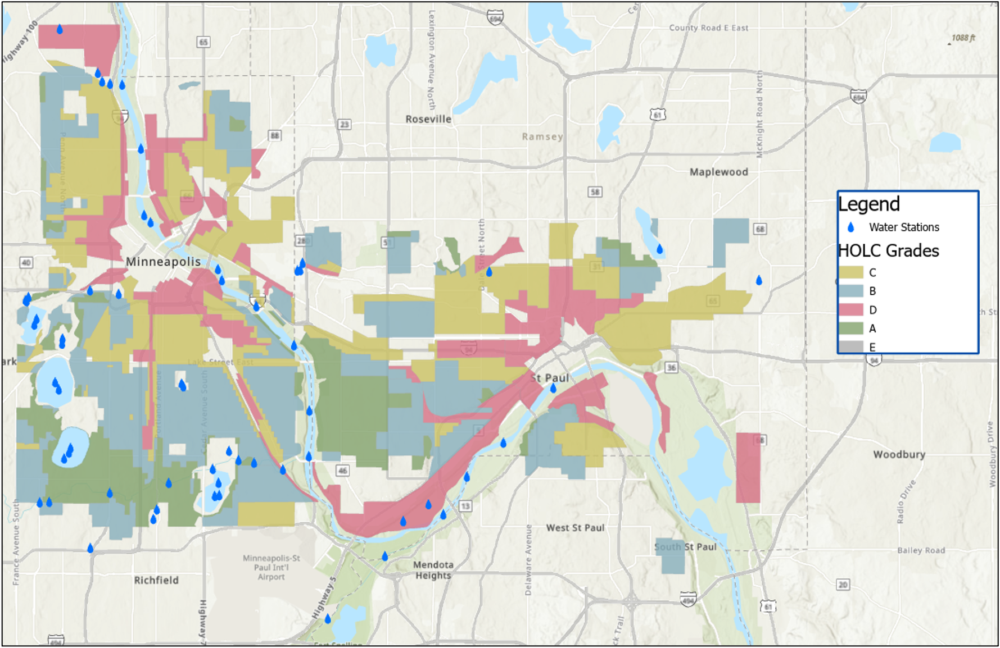
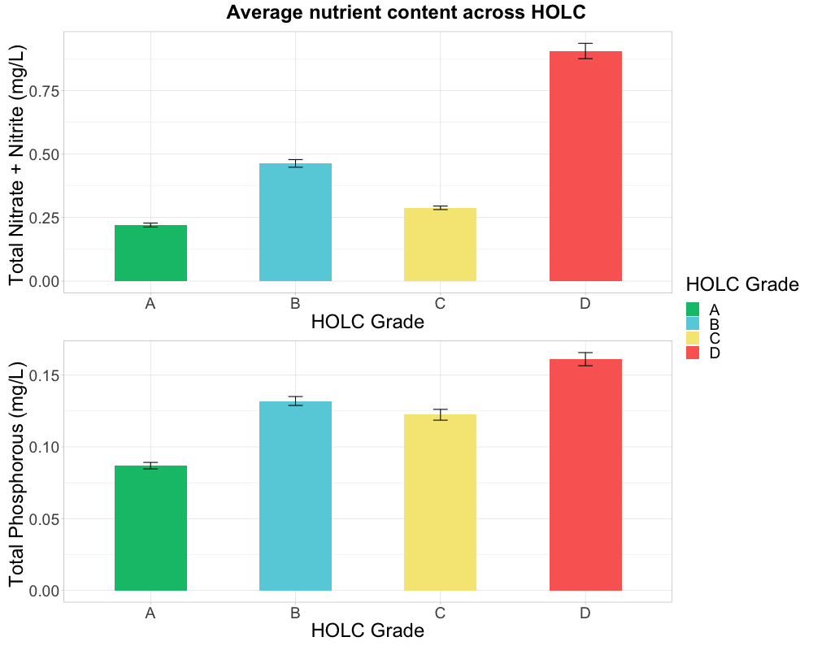
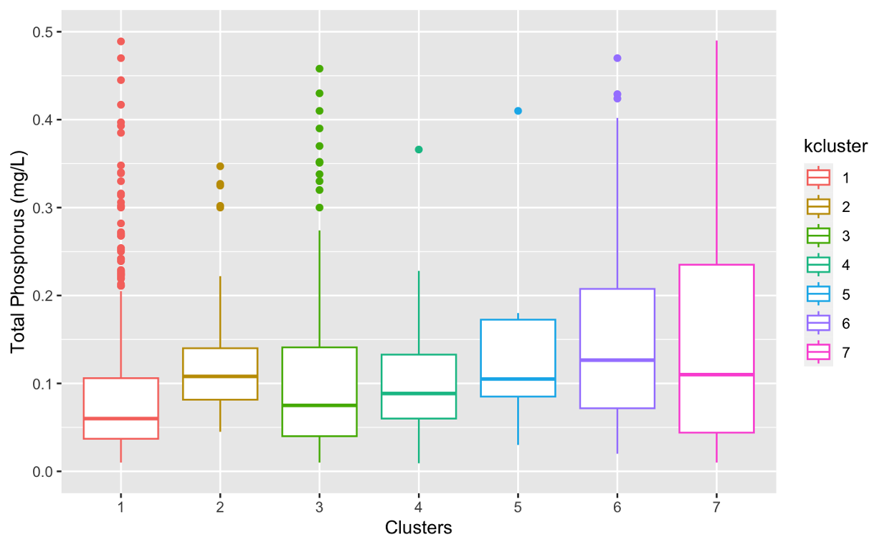
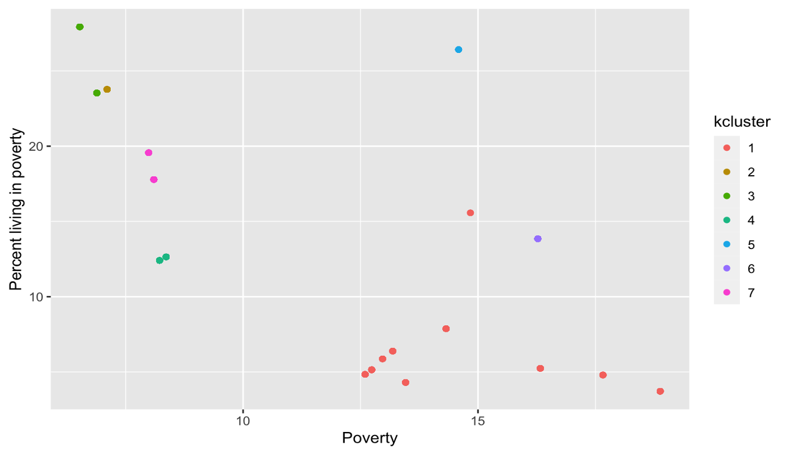
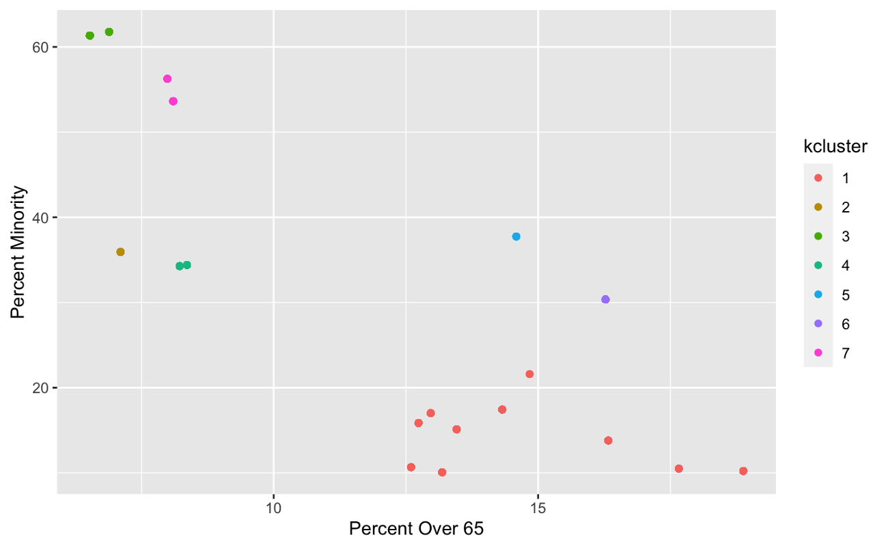
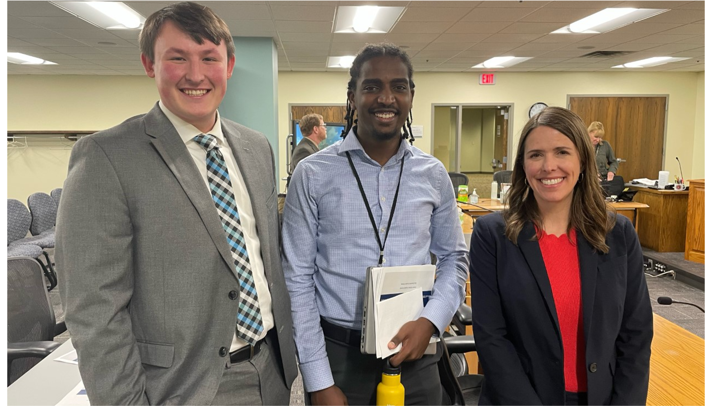

# Work Experience and Projects
____________________________________________
 
## Redlining and Water Quality Research
 
I have been part of a year-long research project at Macalester College with Professor Anika Bratt and Professor Brianna Heggeseth investigating the relationship between redlining and water quality in the Twin Cities metro area in Minnesota. It started as a summer research project in 2022, with my coworkers and friends, CJ Denney and Alex Jabbarpour. I handled the Data aspect of the water quality project looking at historical big data that exists on the topic, while my coworkers went out and collected and analyzed field samples from ponds and lakes. 

This led me to combining a variety of datasets, including redlining data from University of Richmond Digital Scholarship lab (DSL), surface water quality data from the Minnesota Pollution Control Agency (MPCA). Combining these datasets we found a significant relationship between average nutrient content (phosphorus and nitrogen) and redlining. 

I continued my research from the summer through my entire senior year. Our initial results left many questions unanswered. We wanted to refine our statistical approaches, and include more data particularly demographic data! I used demographic and health data compiled by the DSL as well as watershed data from the Department of Natural Resources (DNR). We particularly looked at the ways in which demographic trends coincide with nutrient content and redlining data. This even spilled over into one of my machine learning classes, in which I collaborated with classmate and friend, Lorena Escobosa, to investigate cluster groups in our demographic data using machine learning!

## Public Utilities Commission Internship

During the spring semester of my senior year I interned with the Minnesota Public Utilities Commission (PUC) as a Data Specialist. It was an exciting and important learning experience in the application of data tools, particularly programming, in a workplace, and particularly in the field of government and energy policy.  

I brought on a lot of my programming and coding skills that I have been honing during my time at Macalester College as a Computer Science major. I was able to automate the compilation and cleaning of hundreds of compliance filing dataset on issues such as natural gas service, economic recovery, and distributed energy resources. I then analyzed and visualized.

  

    

      
    

    

      
    

  

At the end of my internship I presented the results of my analysis to the Commissioners! I took their feedback and questions and incorporated them into a revised version of the visualization and data. It was an important exercise in communication and incorporating critique. In addition, it is really cool to see how Commissioners and policymakers think of data and how it informs their decisions. 

