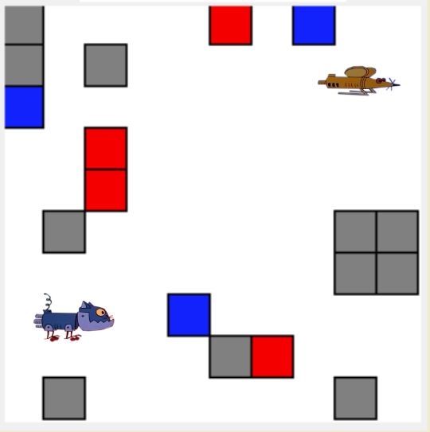
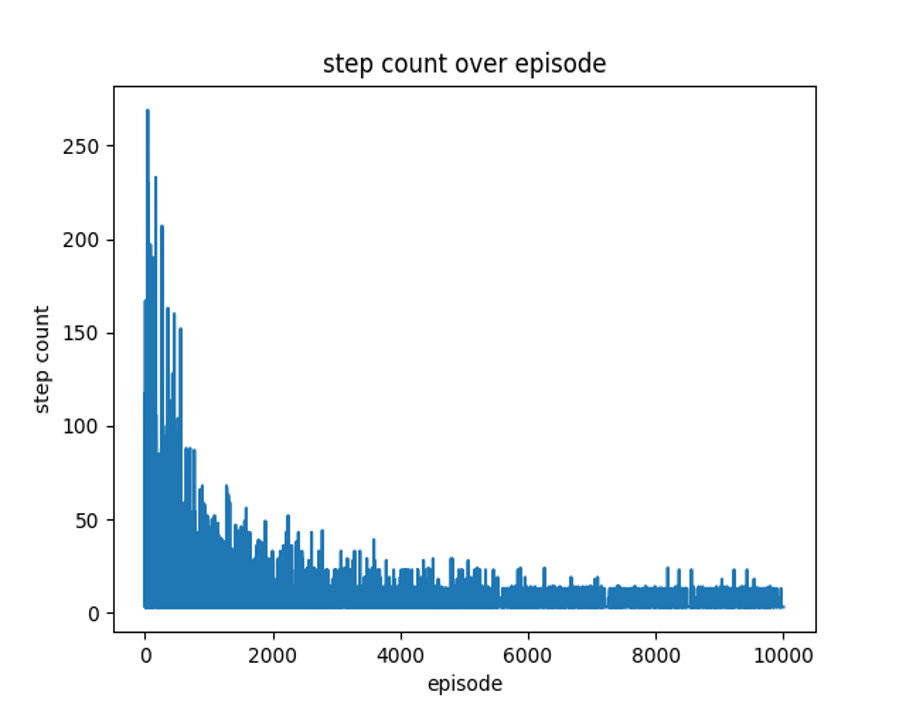
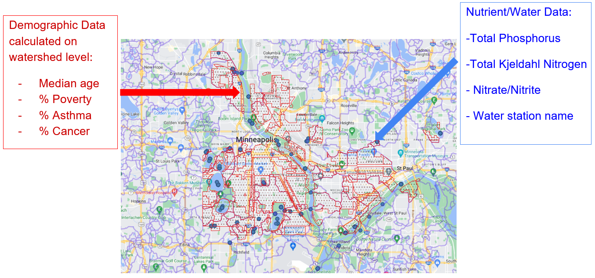

# Skills

Programming skills: Python, SQL, Java, R, C#, C, Unity, spaCy (Natural Language Processing), scikit-learn, Pandas, Tabula, NumPy, Jupyter Notebook, Git

## Data skills

- Cleaning and compilation python scripting with a number of common libraries, including pandas, numpy, tabula, camelot, openxyl and PyPDF.
- Conducting statistical analysis using R and Python
- Creating visualizations using R 

## Artificial Intelligence and Machine Learning

## Visualizations GIS and Maps 

ArcGIS Pro 

